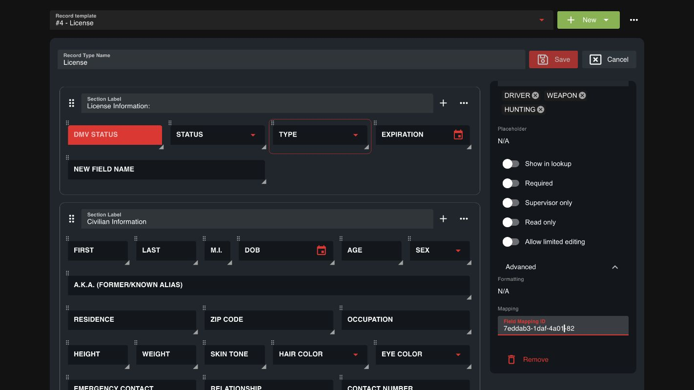

# FivePD Integration for Sonoran CAD

**Unofficial, unsupported, and not maintained.** Provided as-is for communities still using legacy FivePD. Sonoran Software support does not troubleshoot this plugin, and future compatibility updates are not planned.

## Requirements

- A working legacy FivePD 1.5.x installation using FivePD API 1.3.0.
- [SonoranCADFiveM](https://github.com/Sonoran-Software/SonoranCADFiveM/releases/latest) 4.0.119 or newer, configured and connected to your CAD community.
- CAD API access for dispatch calls and custom records. Officers must link their CAD accounts to the server and have an active CAD unit, as well as be on duty in FivePD.

The bridge is built against the published FivePD API and checked against SonoranCADFiveM 4.0.119. It has not been verified in a live FivePD session. Modified FivePD builds and future CAD versions may behave differently.

## Install

1. Download **sonoran_fivepd.zip** from the [latest release](https://github.com/Sonoran-Software/sonoran_fivepd/releases/latest).
2. Copy the included `sonoran_fivepd` folder into your server's resources. Keep that folder name exactly as shown.
3. Copy `put_in_fivepd_plugins/SonoranPlugin.net.dll` into `fivepd/plugins/`, replacing the old DLL if present. Keep FivePD's own API DLLs in place.
4. Review `sonoran_fivepd/config.lua`. Civilian, vehicle, license, and warrant imports are enabled with CAD's default record mapping IDs. For customized templates, follow [Record Mappings](#record-mappings).
5. Add the resource after FivePD and Sonoran CAD in `server.cfg`:

   ```cfg
   ensure sonorancad
   ensure fivepd
   ensure sonoran_fivepd
   ```

6. Restart the server and reconnect. Link your CAD account, go on duty in CAD and FivePD, and accept a callout or make a traffic stop.

**Upgrading from the old plugin:** remove the old `fivepd` folder from `sonorancad/submodules/` and its FivePD configuration from `sonorancad/configuration/`. Replace the old `SonoranPlugin.net.dll`; do not keep a renamed second copy. This version runs as its own resource and does not go inside `sonorancad`.

**Upgrading from 2.0:** back up your configuration, replace both the resource and DLL, and merge your custom settings into the new `config.lua` to use the new default mappings.

## Features

| Trigger | CAD behavior |
| --- | --- |
| Accept a FivePD callout | Creates a dispatch call with its title, description, street, coordinates, case number, and responding officer. Further officers accepting the same FivePD callout are attached to that call. |
| NPCs and vehicles become available during an accepted callout | Automatically imports entities retained by the callout, including later spawns. No command is needed for supported callouts. |
| Complete a callout | Adds one completion note per officer. The CAD call remains open for dispatch to manage. |
| Request a FivePD service | Adds a note to the officer's current imported call, such as a tow or ambulance request. |
| Make a traffic stop | Imports the stopped vehicle, driver, and passengers as CAD vehicle and civilian records. |
| Arrest an NPC | Imports that NPC's civilian record. |
| `/fivepdcadped` (fallback) | Imports the closest networked NPC within 5 metres if automatic discovery cannot find it. |
| `/fivepdcadvehicle` (fallback) | Imports the closest networked vehicle within 15 metres. |

- Civilian data includes name, date of birth, age, gender, and address.
- Vehicle data includes plate, owner name, model, color, and registration status. Insurance and FivePD flags are available for custom mappings.
- Every NPC import also imports available driver, hunting, and weapon licenses and any warrant text. Each record category can be disabled. Fishing licenses require a custom CAD dropdown option and configuration.
- Default mappings use CAD's dropdown values: sex `M`/`F`, uppercase license statuses, and `SUSPENDED` for FivePD's `Revoked` status. Vehicle and license DMV approval is set to approved; the separate status field retains the registration/license validity. Vehicle flags of `Stolen` map to `STOLEN`.
- Imported records and dispatch calls are automatically deleted by CAD after **60 minutes** by default. Set `deleteAfterMinutes` to a whole number from 1 to 1440.
- Repeated imports are skipped until their expiration, including across resource/server restarts. Re-encountered NPCs and vehicles can be imported again after expiration. Imports are snapshots; existing records are not continuously updated.
- Callout response codes map to CAD priorities: Code 1 -> priority 3, Code 2 -> priority 2, Code 3/99 -> priority 1. Unrecognized codes use priority 2. Both the mapping and call codes are configurable.
- An optional postal resource can provide postals. No new API key or changes to the Sonoran CAD resource are needed.

## Record Mappings

The supplied mappings match CAD's default templates: civilian `7`, vehicle `5`, license `4`, and warrant `2`. Customized or older communities should verify their IDs:

1. Open **Admin -> Custom Records** in CAD.
2. Choose the template in **Record template**. The number beside its name is the `recordTypeId`, not an individual record number.
3. Click the destination field, then expand **Advanced** in the field settings panel.
4. Under **Mapping**, copy **Field Mapping ID**. You may need to scroll the settings panel.
5. In `config.lua`, replace the corresponding key in that record's `fields` table with the copied ID. Keep the right-hand value or function. Copy IDs exactly, including underscores. Do not change CAD's IDs just to match this plugin.
6. Restart `sonoran_fivepd`. Existing imports stay unchanged until they expire and are encountered again.

Example: the default license **Type** field maps to FivePD's `LicenseType`:

```lua
['7eddab3-1daf-4a01-82'] = 'LicenseType',
```



*Example editor with default templates; no community or player data.*

- CAD may remove hyphens from older license IDs when a template is saved. The supplied `fieldAliases` handles both default forms. Remove those aliases if you replace the license mappings with custom IDs.
- Dropdown values must match your CAD options. To add fishing licenses, first add `FISHING` to CAD's license Type options, then add `Fishing = 'FISHING'` to `records.license.types`.
- Dates are copied as FivePD provides them; use a mapping function if your CAD uses a different format. Registration expiration, vehicle make, and year are not provided by FivePD and are left blank. Insurance and flag mapping examples are included in `config.lua`.

To restrict access further, set `acePermission = 'sonoran_fivepd.use'` and grant that ACE to your officer group. Otherwise, linked players with active CAD units may use the bridge.

## Behavior and Troubleshooting

- Only NPCs and vehicles encountered through the triggers above are imported. This does not import FivePD's entire database, scan every nearby entity, or sync CAD edits back into FivePD.
- Automatic callout imports begin after acceptance, once the entities exist and are networked on the officer's client. The plugin checks callout fields, auto-properties, arrays, lists, and dictionaries. Computed properties, static fields, and entities hidden inside other helper objects are not inspected. Use the fallback commands for those callouts, or disable callout discovery with `automaticCalloutRecords = false`.
- Callout discovery is bounded to 64 entities and four fetch attempts per pass, with a two-second polling delay and a one-minute cooldown after sending an entity. Shared server-side duplicate suppression prevents officers from creating repeated records. Nothing is imported just because a callout was offered or generated.
- Completion adds a note; it does not close the call, detach officers, change duty status, or create arrest reports. Service notes do not dispatch CAD units. Unaccepted callouts do not create 911 calls.
- Writes are queued and paced, so busy servers may see a delay. Queued work older than three minutes or belonging to a disconnected player is discarded. The CAD API's community-wide rate limits still apply.
- If nothing appears, check that all three resources are started, the DLL is in `fivepd/plugins/`, and the officer is linked and on duty in both systems. Look for `[sonoran_fivepd]` in the server console and the client's F8 console.
- If a record is missing fields, check its CAD mapping IDs and dropdown values. If the server logs an API failure, check API access and configuration; automatic triggers retry while the encounter remains active, or use a fallback command after correcting the issue.
- Keep a backup of `config.lua` before replacing the resource with another copy.

## Source

[FivePD API source](https://github.com/KDani-99/FivePD-API) and the [official FivePD.net 1.3.0 package](https://www.nuget.org/packages/FivePD.net/1.3.0) provide the bridge's API contracts. The old FivePD documentation website is unavailable. [Build and verification notes](DEVELOPMENT.md) are included for anyone maintaining their own fork.
